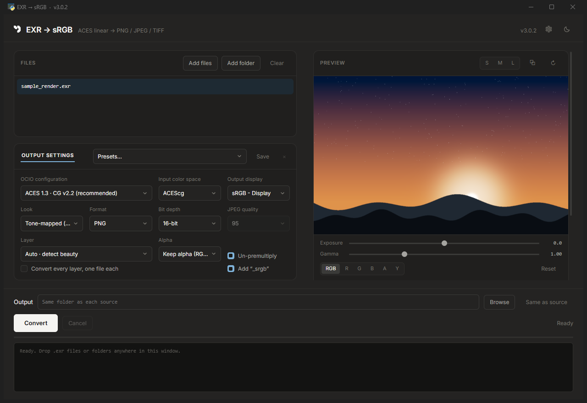
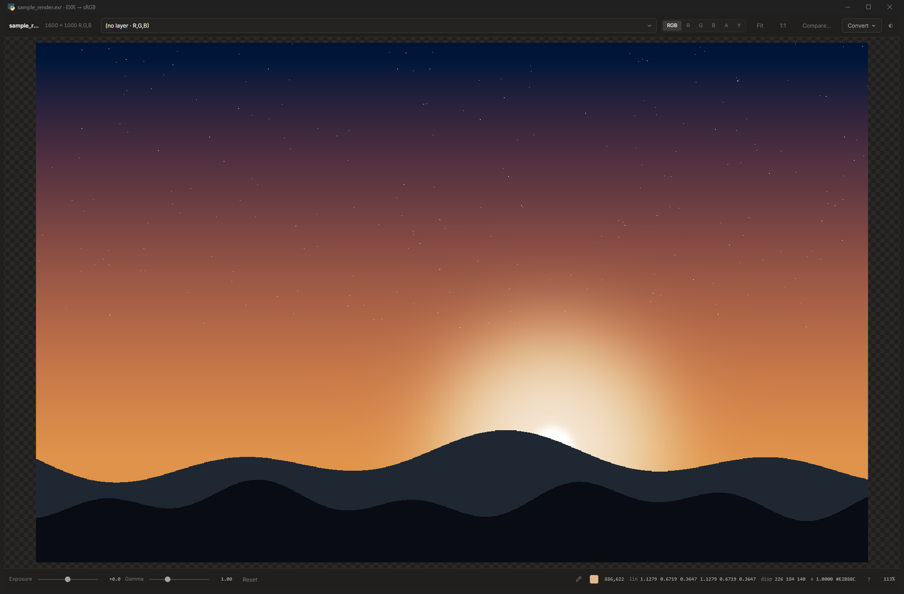

<div align="center">

# EXR → sRGB

**Turn ACES-linear EXR renders into display-ready images — without opening your compositing app.**

[](../../releases)
[](../../releases)
[](LICENSE)
[](../../releases)

Batch convert to **PNG / JPEG / TIFF**, view `.exr` files by double-clicking them,
pull **cryptomatte** mattes, and write **scene-linear 32-bit TIFF** when the
destination is a comp rather than a screen.

<br>

<a href="../../releases/latest/download/EXRtoSRGB.exe">
  
</a>

**One file. Nothing to install.** · [All releases](../../releases) · [What's new](../../releases/latest)

<br>



<br><br>



<sub>Double-click any `.exr` to open it in the viewer. The probe reads the linear
scene value and the display colour side by side.</sub>

</div>

---

Colour is done with **OpenColorIO's built-in ACES configs** — the same engine your
renderer uses — so the output matches your viewport instead of a gamma guess. The
ACES output transform (RRT + ODT) is applied properly, not approximated.

Tested against **Blender Cycles**, **C4D Redshift** and **C4D Octane** output, and
checked frame-for-frame against Nuke conversions of the same renders.

---

## Highlights

|  |  |
|---|---|
| **Correct ACES colour** | Eight ACES configs compiled in, 1.3 and 2.0, CG and Studio. No config files to ship. |
| **Batch, in parallel** | Whole folders at once across a thread pool — **5× faster** than one at a time on a 16-frame run. |
| **A real `.exr` viewer** | Double-click any EXR. Zoom, pan, exposure, gamma, channel isolation, layer switching, pixel probe. |
| **A/B compare** | Load a second render and wipe, flip, or view the difference in linear. |
| **Cryptomatte** | Read the manifest, click objects straight off the image, export mattes. |
| **Multi-part EXR** | Every part of a File Output node's export shows up as a layer. |
| **Sequences** | Drop one frame, get the run. Step through frames next to the preview. |
| **Right-click convert** | Five presets in Explorer, no window opened. |
| **Command line** | `--cli` for a farm, a build step, or a shell loop. |

---

## Install

### [⬇ Download EXRtoSRGB.exe](../../releases/latest/download/EXRtoSRGB.exe)

Run it. That's the whole installation.

Self-contained — the OpenImageIO / OpenColorIO libraries and every ACES config are
compiled in. Nothing to install, no config file to place, no runtime to match.
Windows supplies the webview, so there's no bundled browser either.

There's a sample render in [`docs/sample_render.exr`](docs/sample_render.exr) if you
want something to drop on it straight away — it's scene-linear with the sun well
past 1.0, so it actually shows the ACES highlight roll-off.

<details>
<summary>Run from source instead</summary>

```bash
pip install OpenImageIO OpenColorIO pywebview
python exr2srgb.py
```

`EXR2SRGB_DEBUG=1` opens devtools. Tests are `pip install pytest && pytest -q`.

</details>

---

## Converting

Drag `.exr` files or folders anywhere onto the window, or use **Add files** /
**Add folder**. Whatever you just added is selected automatically.

**Sequences collapse into one row.** A folder of `shot_010.0001.exr … .0240.exr`
reads as `shot_010.####.exr · 240 frames · 1–240`. Drop a *single* frame and the
whole run comes with it — matching stem, frame padding *and* extension, so a
differently padded render or a stray `.png` never joins by accident.

Only one converter window opens at a time; launching again focuses it. Viewers are
unrestricted.

### Output

| | |
|---|---|
| **PNG** | 8 or 16-bit. 16 is the default — gradients survive a trip back into a comp. |
| **JPEG** | 8-bit, quality selectable, no alpha. |
| **TIFF** | 8, 16, or 32-bit float. |
| **Scene-linear TIFF** | 32-bit float, no display transform, no clamp. See [below](#scene-linear-output). |

Un-premultiply is **on** by default, because renders write associated alpha. The
`_srgb` suffix is on too, so converting in place never drops a `.png` next to its
`.exr` with the same stem.

### Presets

Save the combination you actually use — config, display, format, depth — and pick
it next launch. Presets deliberately don't store the output folder: a preset is
*how* to convert, not *where* to put it.

### Every layer at once

Tick **Convert every layer, one file each** and a multi-AOV render writes one image
per layer in a single pass, each named for its layer.

---

## Layers, AOVs and multi-part files

Multi-layer EXRs name channels `<layer>.<component>`. The beauty is auto-detected
by ranking layer *names* — never by matching the component suffix, which is how a
tool ends up exporting Ambient Occlusion as the beauty and nobody notices.

Data layers — normals, position, depth, motion vectors, cryptomatte — are excluded
from auto-detection, since running them through a view transform is meaningless.
You can still select them explicitly.

**Multi-part EXRs work.** Blender's **File Output** node writes one *part* per slot
rather than one channel group per pass, so a custom AOV export is a multi-part file
by construction. Every part is listed as a layer, the beauty is still auto-detected
across all of them, and cryptomatte is read from whichever part carries it.

---

## Colour

### Settings

**OCIO configuration** — eight ACES configs are compiled in:

| | CG | Studio |
|---|---|---|
| **ACES 1.3** | v1.0, v2.1, v2.2 *(default)* | v1.0, v2.1, v2.2 |
| **ACES 2.0** | v4.0 | v4.0 |

Default is **ACES 1.3 · CG v2.2**, which matches the output transform in current
Blender, Octane and Redshift ACES setups. ACES 2.0 is a different look, not a newer
version of the same one — the tone curve genuinely changed.

**ACES 1.2 is not a built-in.** It predates OCIO's built-in registry and only exists
as a downloadable `config.ocio`. Use **Custom config.ocio…** and point at it.

### Matching this in Nuke

Worth getting right, because the wrong pick silently skips the ACES curve.

**With an ACES 1.3 CG/Studio config** (`fn-nuke_cg-config-v2.2.0_aces-v1.3_ocio-v2.4`
and friends), the output transform is a **display + view** pair, not a colorspace:

| Write node | Set to |
|---|---|
| transform type | `display` |
| display | `sRGB - Display` |
| view | `ACES 1.0 - SDR Video` |

> **Don't** pick the colorspace `sRGB Encoded Rec.709 (sRGB)`. It's a plain transfer
> function — identical to the *Un-tone-mapped* view — and highlights clip instead of
> rolling off. The give-away is the ladder below: 1.0 lands on **255** instead of 207.

**With an ACES 1.2 `config.ocio`**, `color_picking (Output - sRGB)` *is* the full
RRT + ODT, so that setting is correct as-is.

**Tick `premultiplied` on the Write node.** Renders carry associated alpha; without
it the display transform is applied to already-premultiplied pixels and antialiased
edges come out with a dark fringe.

### Matching this in After Effects

Use the **ACES 1.3 · CG v1.0** or **Studio v1.0** entry — those are the config
versions After Effects ships with.

### Sanity check

These are correct ACES values. If **1.0 lands on 255**, the ACES curve isn't being
applied — the view has resolved to a plain transfer function.

| ACEScg in | ACES 1.3 → sRGB 8-bit | ACES 2.0 → sRGB 8-bit |
|---|---|---|
| 0.18 | 91 | 89 |
| 1.0 | 207 | 180 |
| 4.0 | 244 | 229 |

### Verified against Nuke

Blender Cycles and C4D Redshift renders, converted here and in Nuke, compared
pixel-for-pixel. Mean 8-bit error:

| Source | Mean error |
|---|---|
| Blender Cycles beauty | **1.09** |
| C4D Redshift beauty | **0.13** |
| Redshift, alpha | **0.05** |

The test suite asserts those bounds, so a colour regression fails the build rather
than shipping.

---

## Viewer

**Double-click any `.exr` and it opens.** Enable **Open .exr files with this viewer**
under the **⚙** in the title bar. The association is per-user, needs no admin rights,
and unticking hands the file type back.

`.exr` files also get their own aperture icon, distinct from the app's, so a file and
the app that opens it don't look identical in Explorer.

The window opens **centred and sized to the image**, up to 1:1, capped to your screen.
Move or resize it and that's remembered.

- **Zoom and pan** — scroll to zoom at the cursor, drag to pan. `F` fits, `1` is actual
  pixels. Past 1:1 the visible region is re-rendered at **source resolution**, so 100%
  means real pixels rather than an upscaled preview.
- **Exposure and gamma** — exposure in stops *before* the display transform, so it
  behaves like a camera stop; gamma after, like a compositor's viewer gamma.
- **Channel isolation** — `R` `G` `B` `A`, `C` back to colour.
- **Layer switching** for multi-layer and multi-part files.
- **Pixel probe** — linear scene values, plus a colour chip and the hex of what's on
  screen. Every value copies on click. The **eyedropper** (`E`) locks one reading so
  it stops following the cursor.
- **Convert** — the same presets as the right-click menu, applied to the layer you're
  looking at.

### A/B compare

Load a second EXR with **Compare…** and flip between them, wipe, or look at the
difference. `\` cycles the four modes.

The difference is taken **in linear**, before the tone curve — a difference of 0.01
then means the same thing in the shadows as in the highlights, and exposure works as
the gain control for reading small ones. The two images must be the same size; a
resized comparison would partly be measuring the resampler.

---

## Cryptomatte

Read the cryptomatte manifest, pick objects, export mattes.

**Pick straight off the ID view: `Ctrl`-click adds, `Alt`-click removes.** Ticked
objects stay lit and everything else dims, so the selection builds up on the image
instead of being hunted through a list.

- **Type** — `CryptoObject`, `CryptoMaterial`, and whatever else the renderer wrote.
  Selections are remembered per type.
- **Filter** a long list; **Select all** acts on what the filter shows.
- **One file per object** or **combine into one**.
- **White silhouette (premultiplied)** or **flat white RGB**. The second forces TIFF,
  because PNG always associates alpha and would turn flat white back into coverage.

---

## Right-click → Convert to sRGB

Enable it under the **⚙** to add a convert submenu to `.exr` files in Explorer:
PNG 8/16-bit, JPEG, TIFF 16-bit, and TIFF 32-bit scene-linear. Conversion runs
headless — no window ever opens.

<details>
<summary>Why it's under "Show more options" on Windows 11</summary>

Windows 11's short menu only accepts `IExplorerCommand` COM handlers from a signed
MSIX or sparse package. That means a native DLL, a package, and a trusted
certificate — no registry verb from any application can reach it, which is why every
unpackaged tool sits in the same submenu.

</details>

---

## Scene-linear output

Set **Look** to *Scene-linear* and the file is data rather than a picture: no display
transform, no clamp, alpha untouched, and 32-bit float TIFF regardless of what else
is selected.

Three things it deliberately does **not** do:

- **Clamp.** Linear values run past 1.0 and that's the point.
- **Touch alpha.** Un-premultiply is skipped, so the output is bit-identical to the
  source layer.
- **Claim to be sRGB.** The file is tagged `colorspace=Linear`, written to
  `ImageDescription` as well as the EXIF tag because TIFF can only express sRGB
  natively and OIIO silently drops an unrecognised value. A linear file labelled sRGB
  gets a transfer function applied twice downstream.

The preview stays display-referred in this mode and says so — raw linear renders as a
near-black smear.

---

## Command line

```bash
EXRtoSRGB.exe --cli shots/ --format png --bits 16 --out out/
```

| Flag | |
|---|---|
| `--out DIR` | output folder (default: beside each source) |
| `--format` `--bits` `--quality` | container and depth |
| `--config NAME` | built-in name, a substring of one, or a path to `config.ocio` |
| `--display` `--input-cs` `--look` | colour; `--look linear` for scene-linear |
| `--layer NAME` `--all-layers` | one layer, or every layer as its own file |
| `--jobs N` | worker threads (default automatic, capped at 8) |
| `--dry-run` | print what would be written and stop |
| `--list-configs` `--list-displays` `--list-layers` | inspect and exit |

Exit codes: **0** fine, **1** some frames failed, **2** nothing to convert, **3** bad
arguments. `--config` refuses an ambiguous match rather than guessing.

---

## Keyboard

Press **?** in either window, or open the **⚙** in the converter.

**Converter** — `↑` `↓` previous / next file · `Ctrl+O` add files · `Ctrl+↵` convert ·
`Esc` cancel · `E` eyedropper · `,` `.` step frames · `Ctrl`/`Alt`-click matte picking

**Viewer** — `F` fit · `1` actual pixels · `+` `−` zoom · `R` `G` `B` `A` channels ·
`C` colour · `E` eyedropper · `\` cycle A/B · `Esc` close

---

## Building

```bash
build_exe.bat
```

Runs `EXRtoSRGB.spec` with PyInstaller. The spec carries the parts that are easy to
get wrong: the OIIO/OCIO DLLs, the `ui/` folder, and pywebview's WebView2 backend.
The exe lands in the repo root; PyInstaller's scratch goes to `%TEMP%`.

---

## How it's built

`core.py` is the conversion — colour pipeline, layer resolution, alpha handling,
sequence grouping, cryptomatte. It imports no UI and is what the test suite
exercises, so colour behaviour is verifiable without opening a window.

`exr2srgb.py` is a [pywebview](https://pywebview.flowrl.com/) window: Python stays
the application and the interface is HTML and CSS rendered by the OS's own webview
(WebView2 on Windows), which is why there's no bundled browser and the download is
around 37 MB rather than 150.

---

## License

MIT — see [LICENSE](LICENSE). Made by [VISOR](https://visor.ooo) for 3D/CGI/VFX
production, and free for anyone to use.

OpenImageIO, OpenColorIO and pywebview are bundled into the built `.exe` under their
own licenses (Apache-2.0 / BSD-style); this repository's MIT license covers the
Python sources, `ui/`, and the build scripts.
